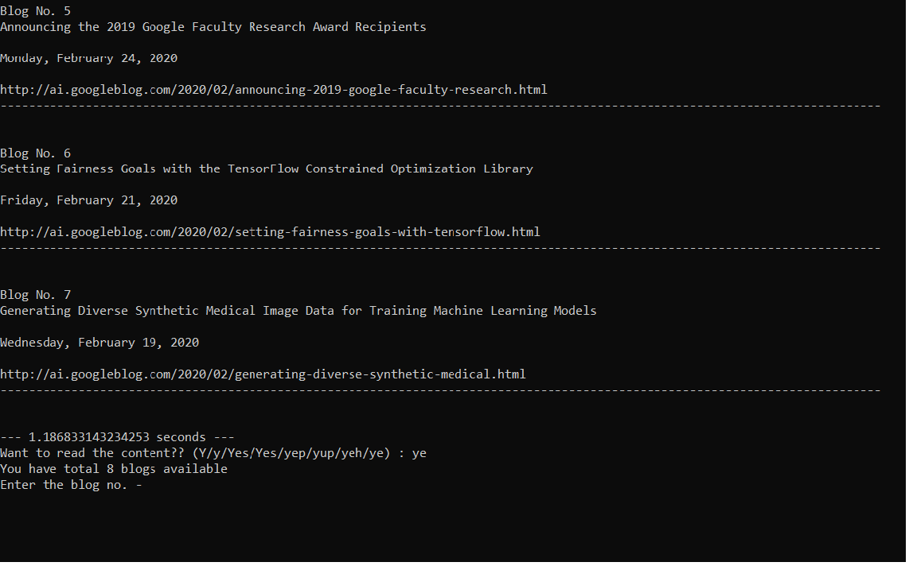

# Google-s-blogs-on-cmd---incognito
Display the Google blog's headings at first and then if you want to deep dive into any of the blogs, you can do that - and best part is everything is on cmd - which made you incognito at first sight of your manager/colleague(s)..

Jokes apart!!

**Step 1** - pip install -r requirements.txt

**Step 2** - python google_blogs_Scraper.py

**Step 3** - say "Yes" if you want to read detailed blog - it will present total # of blogs..

**Step 4** - Enter the # of blog which you are intersted to give a read

**Step 5** - If you further wants to read any other blog - just say "yes" again and repeat the above process till you are done with reading further blogs.

Happy Incognito mode!!
